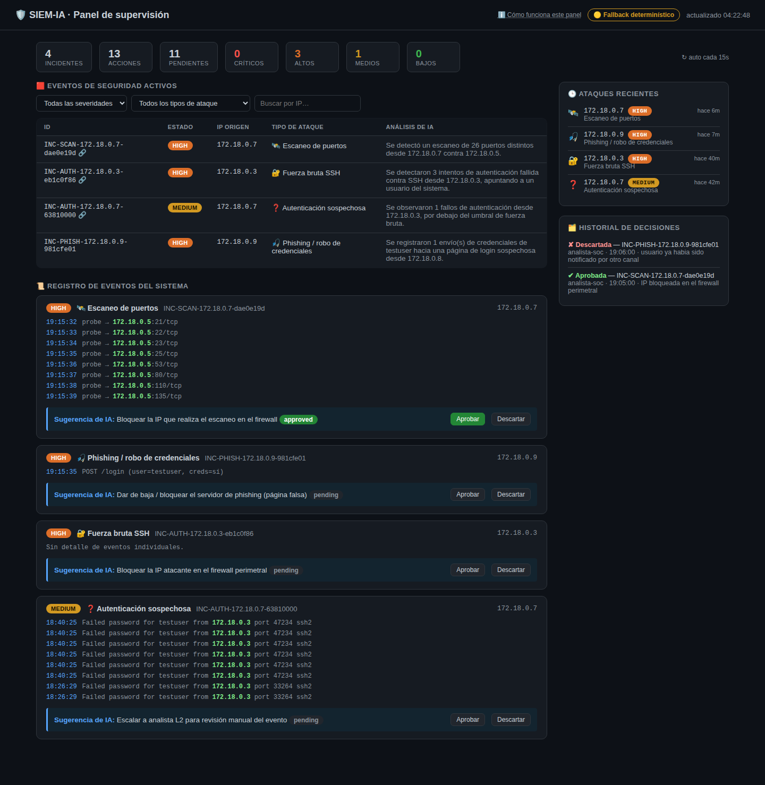
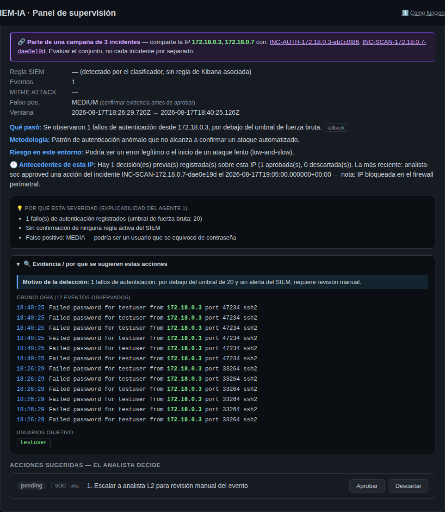
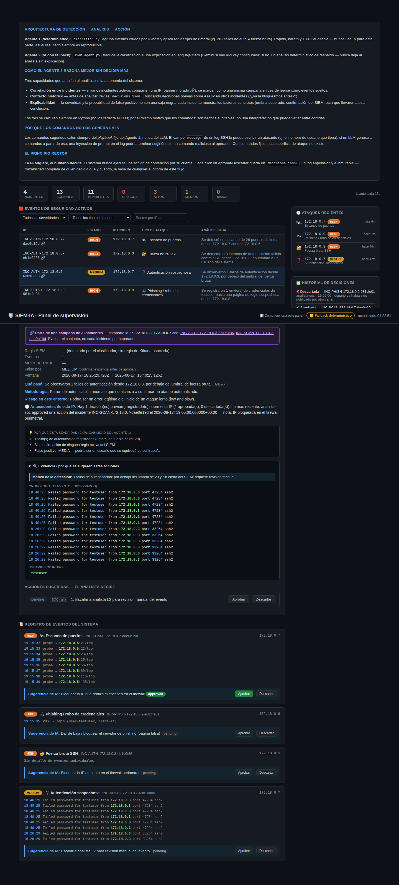

# 09 · El dashboard de supervisión, en detalle

Esta guía documenta cada panel del dashboard (`http://127.0.0.1:5000`, `dashboard.py` +
`templates/index.html`) con capturas reales del sistema corriendo. Para el flujo general
(qué hace cada agente antes de que los datos lleguen acá), ver
[01 · Arquitectura](01-arquitectura.md) y [06 · Flujo de datos](06-flujo-de-datos.md).

## Vista general

De arriba hacia abajo:

> **Los iconos son SVG monocromos, no emoji** (tarea G3). Un emoji se dibuja con la
> paleta del sistema operativo, cambia de forma entre Windows, macOS y Linux y no
> hereda el color del texto. En un panel donde el color significa severidad, eso
> compite con la información. El sprite vive en `templates/_iconos.html` y los
> símbolos usan `currentColor`. Detalle en
> [`12-registro-de-pruebas.md`](12-registro-de-pruebas.md) §4.16.

1. **Cabecera** — título, el link **Cómo funciona este panel** (ver más abajo), y un badge
   que indica si el último análisis lo hizo la IA (*IA (Gemini)*) o el fallback
   determinístico (*Fallback determinístico*). El badge lleva un punto de color —verde
   o ámbar— que toma el color de la propia clase CSS, así que nunca puede discrepar
   del texto.
2. **Barra de resumen** — un número destacado: **cuántas acciones esperan una decisión
   humana**, que es lo que el panel existe para resolver. Se enciende solo si hay
   pendientes. Al lado, como contexto en cuerpo más chico, el total de incidentes y de
   acciones sugeridas; y el desglose por severidad como barra apilada con leyenda, que
   lista las cuatro severidades incluidas las que están en cero (un cero informa: «se
   miró y no hay críticos»). Sin incidentes en la ventana, dice qué correr para generar
   uno. Es lo primero que un analista mira al empezar el turno: cuánto hay para
   revisar y qué tan urgente es.
3. **Eventos de Seguridad Activos** (tabla, filtrable).
4. **Registro de Eventos del Sistema** (feed cronológico).
5. **Ataques Recientes** y **Historial de Decisiones** (columna lateral).

## Eventos de Seguridad Activos

La tabla de trabajo principal. Una fila por incidente, con:

| Columna | Qué muestra |
|---|---|
| **ID** | El `incident_id` (determinístico: prefijo + IP + hash del primer evento). Si tiene el ícono de eslabón al lado, está vinculado a otros incidentes en la misma campaña (ver más abajo). |
| **Estado** | Badge de severidad ajustada por el Agente 2 (Crítica/Alta/Media/Baja). |
| **IP origen** | La IP asociada al incidente (host atacado o IP del atacante, según el tipo). |
| **Tipo de ataque** | Con ícono estable por tipo (`RNF-USA-07`): candado = fuerza bruta SSH, radar = escaneo de puertos, anzuelo = phishing, signo de pregunta = autenticación sospechosa. |
| **Análisis de IA** | Primera oración de la explicación del Agente 2, para no tener que abrir cada incidente solo para saber de qué se trata. |

Arriba de la tabla hay un **filtro por severidad**, uno **por tipo de ataque**, y un
**buscador por IP** — pensado para cuando hay muchos incidentes activos y hace falta
enfocarse en un subconjunto (ej. "solo los críticos", o "todo lo relacionado a esta IP").

Al hacer click en una fila se expande la **card de detalle** debajo de la tabla.

## La card de detalle

De arriba hacia abajo:

- **Banner de campaña** (morado, con eslabón) — aparece solo si el incidente comparte IP con otro(s)
  incidente(s) activos. Ver [Correlación entre incidentes](#correlación-entre-incidentes)
  más abajo. Los IDs relacionados son links: click y salta directo a ese incidente.
- **Ficha técnica** — regla del SIEM que lo originó (o "sin regla asociada" si lo detectó
  solo el clasificador), cantidad de eventos, técnica **MITRE ATT&CK** (linkeada a
  attack.mitre.org), probabilidad de falso positivo con una pista de qué hacer con ella, y
  la ventana temporal.
- **Análisis en lenguaje claro** — qué pasó, metodología del ataque, riesgo en este entorno,
  referencias, y **antecedentes de esta IP** (contexto histórico — ver más abajo).
- **Por qué esta severidad** (bombilla) — la lista de factores concretos que el Agente 1 usó para
  clasificar (ver [Explicabilidad](#explicabilidad)).
- **Evidencia** (lupa) — cronología cruda de los eventos observados (con las IPs resaltadas en
  verde), puertos sondeados, URLs de phishing, usuarios objetivo — todo lo que sustenta la
  detección, colapsable.
- **Acciones sugeridas** — el playbook del Agente 1: cada acción con responsable, plazo,
  comando (si aplica) **y su explicación en lenguaje claro de qué hace ese comando
  exactamente**, y los botones **Aprobar** / **Descartar**.

## Registro de Eventos del Sistema

Un feed cronológico que junta la evidencia de **todos** los incidentes activos (no solo el
seleccionado), para que el analista pueda leer "qué estuvo pasando" de corrido sin tener que
abrir incidente por incidente. Cada bloque trae su propia mini-cronología de eventos y, al
pie, la sugerencia principal de la IA con los mismos botones Aprobar/Descartar — se puede
decidir directamente desde acá.

## Ataques Recientes

Lista compacta en la barra lateral, ordenada por `last_seen`: los últimos incidentes con
ícono de tipo, severidad, IP y tiempo relativo ("hace 6m"). Es la vista de "qué pasó
últimamente" — a diferencia de la tabla principal, no se filtra, siempre muestra la
actividad más reciente de un vistazo.

## Historial de Decisiones

Muestra las decisiones tomadas, más recientes primero. **Importante:** el archivo
`decisions.jsonl` es append-only — cada click en Aprobar/Descartar agrega una línea nueva y
nunca se borra nada, porque es el registro de auditoría del sistema (ver
[08 · Puesta en marcha](08-puesta-en-marcha-paso-a-paso.md) y el principio rector en
[00 · Contexto](00-contexto-y-problema.md)). Pero **este panel** deduplica por acción y
muestra solo la decisión más reciente de cada una — si una acción se aprobó y después se
descartó, se ve el estado actual, con una nota "(revisado N×)" si hubo más de una decisión
sobre la misma acción. El archivo completo, con cada revisión, se sigue pudiendo auditar leyendo
`decisions.jsonl` directamente o vía `GET /api/decisions`.

## El panel "Cómo funciona este panel"

Colapsable desde el header (*Cómo funciona este panel*). Pensado para quien evalúa el
sistema, no para el uso diario del analista: resume la arquitectura de 2 agentes, las 3
capacidades de IA (correlación, contexto histórico, explicabilidad — ver abajo) y por qué los
comandos nunca los genera el LLM.

---

## Correlación entre incidentes

Implementada en `classifier.py::_link_campaigns()`. Al terminar de clasificar todos los
incidentes de una corrida, el Agente 1 revisa si alguno comparte IP (`source_ip` o
`attacker_ips`) con otro — aunque vengan de detecciones distintas. Ejemplo real observado en
este proyecto: una misma IP hizo un escaneo de puertos y, poco después, apareció fuerza bruta
SSH contra el mismo host — sin correlación, son 2 incidentes "Alta" sueltos; con
correlación, el dashboard los marca como una sola campaña de 2+ frentes, que es lo que
realmente está pasando.

## Contexto histórico

Implementado en `siem_agent.py::historical_context()`. Antes de generar el análisis, el
Agente 2 busca en `decisions.jsonl` si ya hubo alguna decisión sobre alguna de las IPs de este
incidente, tomada en **otro** incidente (no en el mismo, para no auto-citarse). Si encuentra
algo, arma un resumen: cuántas decisiones previas, cuántas aprobadas/descartadas, cuál fue la
más reciente y quién la tomó. Esto requiere que `dashboard.py` guarde la IP del incidente al
momento de decidir — se agregó `source_ip`/`attacker_ips` al registro que se escribe en
`decisions.jsonl` en `/api/decision`.

## Explicabilidad

Implementado en `classifier.py::_classification()`, parámetro `factores`. Cada rama de
detección (SSH, port scan, phishing) arma una lista de señales concretas que sustentan la
severidad y la probabilidad de falso positivo — no es una calificación arbitraria: se puede
señalar exactamente qué umbral se superó, si el SIEM confirmó el patrón con una regla activa,
cuántos hosts/usuarios están afectados. Es la respuesta a "¿por qué la IA dice que esto es
Alto y no Medio?" con una lista verificable, no una caja negra.

## Cómo se prueba (nota de calidad de software)

Este dashboard se verificó con **Playwright** contra el servidor real (no mocks): se generó
tráfico de ataque real (Hydra contra `ssh-target`, eventos NDJSON sintéticos para port
scan/phishing), se corrió el pipeline completo online (`prepare-for-ia.py → classifier.py →
siem_agent.py`) y se comprobó en el navegador que la tabla, los filtros, el feed, el banner de
campaña y los botones Aprobar/Descartar funcionan de punta a punta contra datos reales — sin
errores de consola JS. Las capturas de esta guía son de esa misma corrida.

---

## Dónde vive el código del panel

Desde el refactor **R-05** (17-09-2026) el panel está repartido en tres archivos,
y no todo dentro de la plantilla:

| Archivo | Qué contiene |
|---------|--------------|
| `templates/index.html` | Solo marcado (98 líneas). Referencia los estáticos con `url_for` |
| `static/app.js` | Toda la lógica del cliente (584 líneas) |
| `static/app.css` | La hoja de estilos (198 líneas) |
| `templates/login.html` + `static/login.js` | Pantalla de inicio de sesión |

**Por qué se separó.** Mientras el `<script>` vivía dentro del HTML, ESLint no lo
analizaba: los dos linters de JavaScript del proyecto corrían sobre cero
archivos. Ver [`12-registro-de-pruebas.md`](12-registro-de-pruebas.md) §4.7.

**Cómo se escapa el contenido.** Todo el HTML se arma con la plantilla etiquetada
`html`, que escapa cada valor interpolado salvo los fragmentos que ella misma
produce. Antes había que acordarse de envolver cada valor en `esc()`; ahora
olvidarse no es posible.
