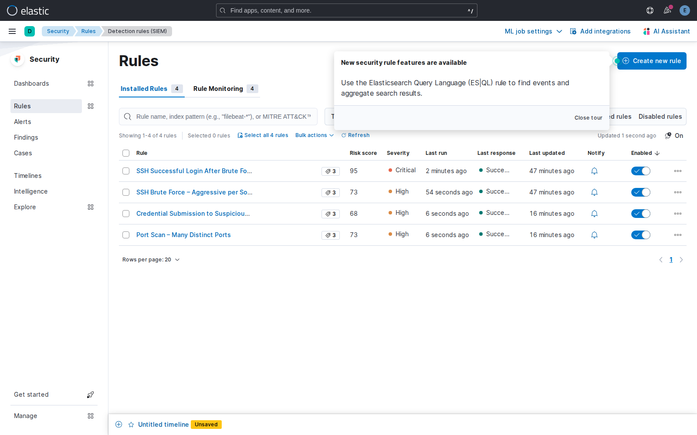

# 01 · Alertas recomendadas

`rules/rules.md` trae 14 configuraciones de regla listas para crear. Activar las 14
de una — con equipos chicos, que es el escenario real que este proyecto apunta a
resolver (ver [contexto y problema](../00-contexto-y-problema.md)) — es la forma más
rápida de terminar con un dashboard saturado y volver a sufrir alert fatigue, que es
exactamente el problema que el sistema existe para evitar.

Esta guía prioriza en 3 niveles: qué activar siempre, qué sumar después, y qué dejar
como opcional. Cada regla referencia su ID en `rules/rules.md` para el detalle
completo (query, umbral, severidad, MITRE).

## Nivel 1 — Imprescindibles (activar desde el día uno)

Estas 4 son las que tienen correspondencia directa con lo que `classifier.py` ya sabe
clasificar y explicar. Sin ellas, la capa de IA no tiene de qué agarrarse.

> **✅ Las 4 están creadas y activas en este despliegue** (vía la API de Kibana, ver
> [`docs/07`](../07-reglas-de-deteccion.md#detection-as-code-crear-reglas-por-api-recomendado)
> para los comandos exactos y capturas). Screenshot real de las 4 corriendo:
> 

| Regla | Por qué vale la pena |
|-------|----------------------|
| **A2 · SSH Brute Force – Aggressive per Source IP** (`rules/rules.md`) | Es el caso de uso principal del proyecto: 10+ fallos de auth desde una misma IP en 1 minuto. Umbral alto → prácticamente nunca es un falso positivo. |
| **A4 · SSH Successful Login After Brute Force** | La más importante de las 14: un login **exitoso** justo después de una ráfaga de fallos. Esto ya no es "posible ataque", es **compromiso probable** — casi cero falsos positivos, severidad Critical justificada. |
| **B1 · Port Scan – Many Distinct Ports** | Cubre el segundo tipo de ataque del proyecto (reconocimiento de red). Un umbral de 10+ puertos distintos filtra los sondeos ocasionales de una sola conexión. |
| **C1 · Credential Submission to Suspicious Login** | Cubre el tercer tipo (phishing). Dispara con la certeza más alta posible: hubo un POST con credenciales a una página marcada como sospechosa. |

## Nivel 2 — Recomendadas (sumar una vez que el Nivel 1 esté estable)

Amplían la cobertura a variantes de ataque que el Nivel 1 no ve, sin agregar mucho
ruido.

| Regla | Por qué vale la pena |
|-------|----------------------|
| **A6 · SSH Brute Force – Multiple Users Targeted** | Detecta *password spraying* (una IP prueba pocas contraseñas contra muchos usuarios), un patrón que A2 no captura porque no se concentra en un solo usuario. |
| **B3 · Sensitive Port Probe** | Un solo intento contra puertos como 3389 (RDP), 445 (SMB) o 3306 (MySQL) ya es relevante — a diferencia de un puerto cualquiera, donde hace falta un patrón de varios para que importe. |
| **C2 · Repeated Credential Harvesting** | Detecta campaña activa (3+ víctimas distintas enviando credenciales a la misma IP), útil para escalar la severidad cuando C1 ya disparó una vez. |

## Nivel 3 — Opcionales (activar si sobra capacidad de revisión)

Son legítimas, pero con más superficie de falso positivo o que requieren un entorno
de red más grande para que el patrón se note.

| Regla | Por qué es opcional |
|-------|----------------------|
| **A3 · SSH Invalid User Enumeration** | Un typo de un usuario real generando "invalid user" también puede disparar esto. Útil como señal de reconocimiento temprano, pero conviene revisar en modo `Per rule run`, no `For each alert`. |
| **B2 · Port Scan – Horizontal (Multiple Hosts)** | Necesita 5+ hosts distintos sondeados por la misma IP — en una red chica (como el `network_logs/` sintético de este proyecto) rara vez se junta esa cantidad de hosts, así que aporta poco hasta que la topología crezca. |

No incluidas en esta guía por ahora: **A1** y **A5** (quedan cubiertas por A2, que ya
es más agresiva y específica), **C3** (EQL de secuencia GET→POST; útil pero
redundante con C1+C2 combinadas) y **A7** (umbral 1 a propósito — ver "Qué NO
hacer" más abajo). Siguen disponibles en `rules/rules.md` si hace falta esa
granularidad extra.

## Qué NO hacer (alertas que no valen la pena)

- **No bajar el `Threshold` de fuerza bruta a 2-3.** Cualquier persona que se
  equivoca de contraseña dos veces dispara la regla. El umbral recomendado (5 para
  la regla básica, 10 para la agresiva) ya filtra ese ruido — ver la nota en
  [`docs/07`](../07-reglas-de-deteccion.md). **A7 · SSH Isolated Authentication
  Failure** es la excepción deliberada: umbral 1, severidad Low, pensada para
  demostrar el escalón más bajo de la escalera de severidad (junto a A1 Medium, A2
  High, A4 Critical), no para dejarse encendida en un entorno real — ahí sí generaría
  una alerta por cada error de tipeo.
- **No marcar todo como `Critical`.** Si todas las severidades son iguales, la
  severidad deja de ser información. Reservar `Critical` para lo que de verdad exige
  reacción inmediata (como A4).
- **No crear reglas que se pisan entre sí.** Por ejemplo, tener activas A1 y A2 a la
  vez sobre el mismo patrón de fuerza bruta genera dos alertas por el mismo evento.
  Elegir una variante por patrón (ver Nivel 1) en vez de todas las del catálogo.
- **No usar `For each alert` en severidades bajas/medias.** Notifica por cada
  ocurrencia individual y es la forma más rápida de generar fatiga; reservarlo para
  High/Critical (ver el resumen de pasos en [`docs/alertas/README.md`](README.md)).
- **No dejar `False positives` vacío al crear la regla.** Ese campo no es
  decorativo: documentar ahí qué comportamiento legítimo podría disparar la regla
  por error es lo que le permite al analista descartar rápido sin dudar.
